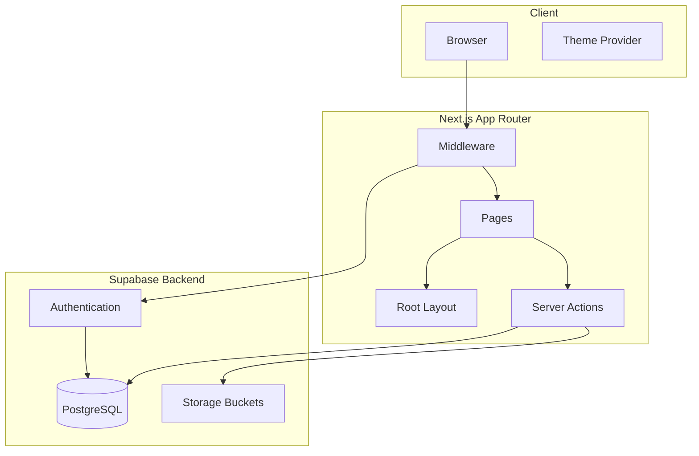

# Codebase Index - Cult Directory Template

## Project Overview

**Name:** Cult Directory Template  
**Type:** Full-stack Next.js application with Supabase backend  
**Description:** A directory template for showcasing products/tools with user authentication, product submission, and admin capabilities.

---

## Technology Stack

| Category | Technology |
|----------|------------|
| Framework | Next.js (latest, App Router) |
| Language | TypeScript 5.3.3 |
| Styling | Tailwind CSS 3.4.1 + Shadcn UI |
| Database | Supabase (PostgreSQL) |
| Authentication | Supabase Auth |
| Form Handling | React Hook Form + Zod |
| UI Components | Radix UI primitives |
| Animations | Framer Motion |
| Charts | Recharts |
| AI SDK | Vercel AI SDK (Anthropic/OpenAI) |

---

## Project Structure

```
/
|-- app/                          # Next.js App Router
|   |-- actions/                  # Server Actions
|   |   |-- cached_actions.ts     # Cached filter queries
|   |   |-- product.ts            # Product CRUD operations
|   |-- auth/
|   |   |-- callback/route.ts     # Auth callback handler
|   |-- login/                    # Authentication pages
|   |   |-- form.tsx              # Login form component
|   |   |-- page.tsx              # Login page
|   |   |-- password/             # Password reset flow
|   |-- products/                 # Product listing pages
|   |   |-- [slug]/               # Dynamic product detail routes
|   |   |-- layout.tsx
|   |   |-- page.tsx
|   |-- submit/                   # Product submission
|   |   |-- action.ts             # Submit server action
|   |   |-- form.tsx              # Submission form
|   |   |-- schema.ts             # Zod validation schema
|   |-- layout.tsx                # Root layout
|   |-- page.tsx                  # Home page
|   |-- providers.tsx             # Theme provider
|
|-- components/
|   |-- cult/                     # Custom components
|   |   |-- fade-in.tsx
|   |   |-- fallback-image.tsx
|   |   |-- file-drop.tsx         # File upload component
|   |   |-- gradient-heading.tsx
|   |   |-- minimal-card.tsx
|   |-- ui/                       # Shadcn UI components (20+ components)
|   |-- directory-card-grid.tsx   # Product card grid
|   |-- directory-product-card.tsx # Individual product card
|   |-- directory-search.tsx      # Search component
|   |-- hero.tsx                  # Hero section
|   |-- nav.tsx                   # Navigation sidebar
|
|-- db/
|   |-- schema.sql                # Legacy schema (businesses table)
|   |-- supabase/
|   |   |-- client.ts             # Browser client
|   |   |-- middleware.ts         # Auth middleware helper
|   |   |-- server.ts             # Server client
|
|-- hooks/                        # Custom React hooks
|   |-- use-callback-ref.ts
|   |-- use-controllable-state.ts
|   |-- use-resource-click-counter.tsx
|   |-- use-upload-file.ts
|
|-- lib/
|   |-- error.ts
|   |-- utils.ts                  # Utility functions (cn, etc.)
|
|-- supabase/
|   |-- migrations/               # Database migrations
|   |   |-- 20231227195622_init_user.sql
|   |   |-- 20231227203518_init_functions.sql
|   |   |-- 20240115152002_grant-fn-access.sql
|   |   |-- 20240520031444_products.sql  # Main products table
|   |   |-- 20240606173018_buckets.sql
|   |   |-- 20240606223748_filters.sql
|   |   |-- 20250520031517_viewcount.sql
|
|-- public/                       # Static assets
|-- fonts/                        # Custom fonts (Haskoy)
```

---

## Database Schema

### Products Table (Primary)

```sql
CREATE TABLE public.products (
  id UUID PRIMARY KEY DEFAULT gen_random_uuid(),
  created_at TIMESTAMPTZ DEFAULT now(),
  full_name TEXT NOT NULL,
  email TEXT NOT NULL,
  twitter_handle TEXT NOT NULL,
  product_website TEXT NOT NULL,
  codename TEXT NOT NULL UNIQUE,
  punchline TEXT NOT NULL,
  description TEXT NOT NULL,
  logo_src TEXT,
  user_id UUID REFERENCES auth.users(id),
  tags TEXT[],
  view_count INTEGER DEFAULT 0,
  approved BOOLEAN DEFAULT false,
  featured BOOLEAN DEFAULT false,
  labels TEXT[],
  categories TEXT
);
```

### Product Views Table

```sql
CREATE TABLE public.product_views (
  id UUID PRIMARY KEY DEFAULT gen_random_uuid(),
  product_id UUID REFERENCES products(id),
  viewed_at TIMESTAMPTZ DEFAULT now()
);
```

### Key Database Features

- **Row Level Security (RLS)** enabled on products table
- **Policies** for user-owned product operations
- **Triggers** for automatic view count updates
- **Indexes** on categories, tags (GIN), labels (GIN)

---

## Application Features

### Public Features
- Product directory browsing
- Search by codename, description, punchline
- Filter by categories, tags, labels
- Product detail pages
- View count tracking

### User Features
- Authentication (email/password)
- Product submission with logo upload
- Password reset flow

### Admin Features (Paid Version)
- Admin dashboard at `/admin`
- Product management
- User management
- Filter management
- Analytics dashboard

---

## Key Components Analysis

### Navigation ([`nav.tsx`](components/nav.tsx))
- Responsive sidebar with mobile sheet
- Category/tag/label filtering
- Admin navigation with tooltips
- User dropdown menu
- Dark/light mode toggle

### Product Grid ([`directory-card-grid.tsx`](components/directory-card-grid.tsx))
- Masonry-style grid layout
- Featured product section
- Empty state with promotional content

### Product Submission ([`submit/form.tsx`](app/submit/form.tsx))
- Multi-step form with validation
- File upload for logos
- Category selection
- Real-time validation feedback

---

## Server Actions

### [`product.ts`](app/actions/product.ts)
- `getFilters()` - Fetch all categories, labels, tags
- `getProducts()` - Search/filter products with caching
- `getProductById()` - Single product fetch
- `incrementClickCount()` - View count tracking

---

## Authentication Flow

1. **Login Page** ([`app/login/page.tsx`](app/login/page.tsx))
2. **Auth Callback** ([`app/auth/callback/route.ts`](app/auth/callback/route.ts))
3. **Middleware** ([`middleware.ts`](middleware.ts)) - Session refresh
4. **Server Client** ([`db/supabase/server.ts`](db/supabase/server.ts)) - SSR support

---

## Scripts Available

| Script | Description |
|--------|-------------|
| `pnpm dev` | Development server |
| `pnpm build` | Production build |
| `pnpm start` | Production server |
| `pnpm lint` | ESLint |
| `pnpm check-types` | TypeScript check |
| `pnpm seed:products` | Seed products |
| `pnpm bulk:enrich` | AI enrichment |
| `pnpm format:write` | Prettier format |

---

## Environment Variables Required

```bash
NEXT_PUBLIC_SUPABASE_URL=
NEXT_PUBLIC_SUPABASE_ANON_KEY=
SUPABASE_PROJECT_ID=
SUPABASE_ADMIN_ID=  # For admin features
ANTHROPIC_API_KEY=  # For AI enrichment
```

---

## Dependencies Highlights

### Production
- `@supabase/ssr` & `@supabase/supabase-js` - Database/Auth
- `@radix-ui/react-*` - UI primitives
- `react-hook-form` + `@hookform/resolvers` - Forms
- `zod` - Validation
- `framer-motion` - Animations
- `lucide-react` - Icons
- `recharts` - Charts
- `sonner` - Toast notifications
- `vaul` - Drawer component
- `cmdk` - Command palette

### Development
- `prettier` + `@ianvs/prettier-plugin-sort-imports`
- `@types/*` packages

---

## Ready for Changes

The codebase is now indexed and ready for modifications. Key areas that can be modified:

1. **UI/Styling** - Tailwind config, Shadcn components
2. **Database** - New migrations, schema changes
3. **Features** - New pages, components, actions
4. **Authentication** - Auth flows, protected routes
5. **API** - Server actions, API routes
6. **AI Features** - Enrichment scripts, prompts

---

## Diagram: Application Architecture



---

## Next Steps

To proceed with changes, please specify:

1. What features need to be added or modified?
2. Are there any bug fixes required?
3. Do you need database schema changes?
4. Are there UI/UX improvements needed?
5. Any third-party integrations required?